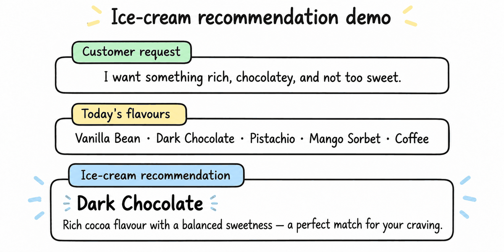

# Ice-cream recommendation observability demo

A small demo that recommends an ice-cream flavour from a randomly selected
list. It uses OpenAI for request generation and recommendations, and Langfuse
for prompt management and tracing.



## How it works

1. Five flavours are randomly selected from the catalogue.
2. OpenAI generates a realistic customer request.
3. The managed Langfuse prompt is compiled with the available flavours.
4. OpenAI recommends a flavour, with both calls captured in one Langfuse trace.

## Setup

1. Create a Python 3.11 virtual environment and install the project:

   ```console
   python -m venv .venv
   .venv\Scripts\python -m pip install -e .
   ```

2. Configure your editor to use `.venv\Scripts\python.exe` as its Python
   interpreter.
3. Copy `.env.example` to `.env` and replace the placeholder credentials.
4. In Langfuse, create a text prompt named `ice-cream-flavour-prompt`. The
   prompt must contain a `{{flavours}}` variable and have the `production`
   label. For example:

   ```text
   Recommend one ice-cream flavour from this list: {{flavours}}.
   Explain briefly why it suits the customer's request.
   Do not recommend a flavour outside the list.
   ```

   The application uses an equivalent local fallback until this managed
   prompt exists, so a missing prompt will not stop the demo.

## Run

```console
.venv\Scripts\python main.py
```
